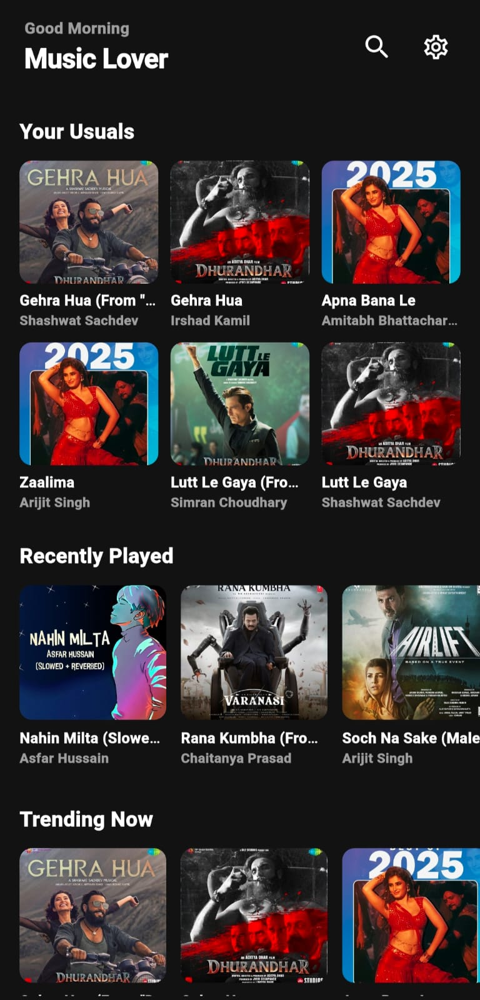
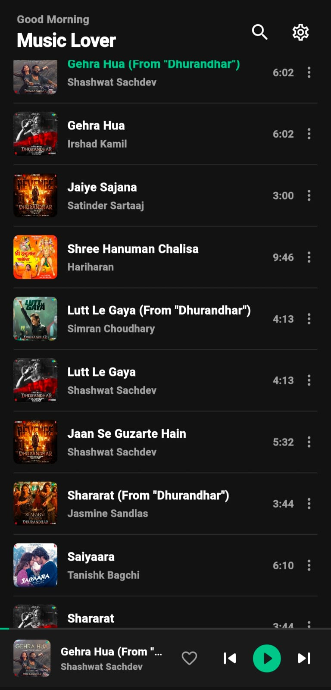
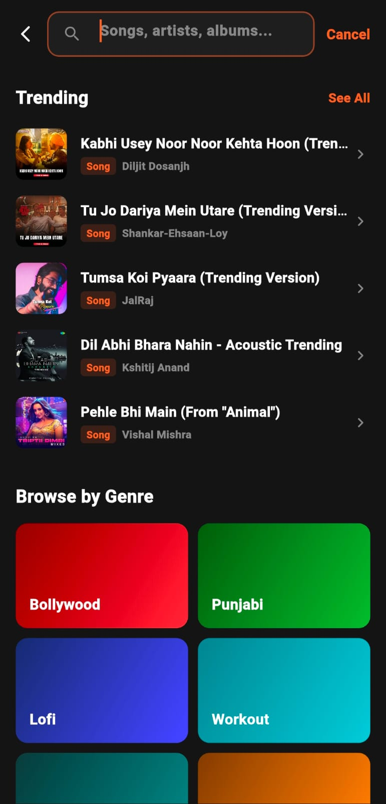

# OneMusic 🎵

> Free • Open Source • Modern Music Streaming Experience

OneMusic is a modern open-source music streaming application built with Flutter and designed for users who want a clean, fast, and distraction-free music experience.

No ads.
No subscriptions.
No unnecessary complexity.

Built under the OnePersonAI ecosystem.

---

## ✨ Features

* 🎧 Smart autoplay system
* 🔥 Infinite music queue
* 🌙 Premium dark UI
* ❤️ Liked songs support
* 🕘 Recently played history
* 🚀 Lightweight and optimized
* 🔍 Fast search experience
* 📱 Modern responsive design
* 🆓 Completely free to use
* 🌍 Open-source and community driven

---

## 🖼 Screenshots

  
  
  
  

---

## ⚡ Tech Stack

* Flutter
* Dart
* Open Music APIs
* Modern UI/UX Design
* GitHub Releases
* Vercel Website Hosting

---

## 🌐 Official Website

[https://onemusic-website.vercel.app/](https://onemusic-website.vercel.app/)

---

## 📥 Download APK

Download the latest release from:

[https://github.com/AkshatRaj00/OneMusic/releases/tag/main](https://github.com/AkshatRaj00/OneMusic/releases/tag/main)

---

## 🚀 Why OneMusic?

Most music apps today are overloaded with:

* ads
* subscriptions
* login walls
* unnecessary tracking

OneMusic focuses on what actually matters:

> Music experience first.

The goal is to build a fast, beautiful, open music platform for everyone.

---

## 🧠 Vision

OneMusic is the first product under **OnePersonAI** — an ecosystem focused on building modern AI and consumer technology products with clean user experiences and open innovation.

---

## 🤝 Contributing

Contributions are welcome.

You can:

* report bugs
* improve UI/UX
* optimize performance
* suggest features
* contribute code

Fork the repository and create a pull request.

---

## 🔗 Connect

* Website: [https://onepersonai.in/](https://onepersonai.in/)
* GitHub: [https://github.com/AkshatRaj00](https://github.com/AkshatRaj00)
* LinkedIn: [https://www.linkedin.com/in/akshatraj00/](https://www.linkedin.com/in/akshatraj00/)
* X: [https://x.com/AkshatRaj00](https://x.com/AkshatRaj00)_

---

## ⭐ Support

If you like the project:

* Star the repository
* Share with friends
* Contribute to development
* Join the community

---

## 📜 License

This project is open-source and available under the MIT License.

---

  Built with ❤️ by OnePersonAI

date workflow note
test
